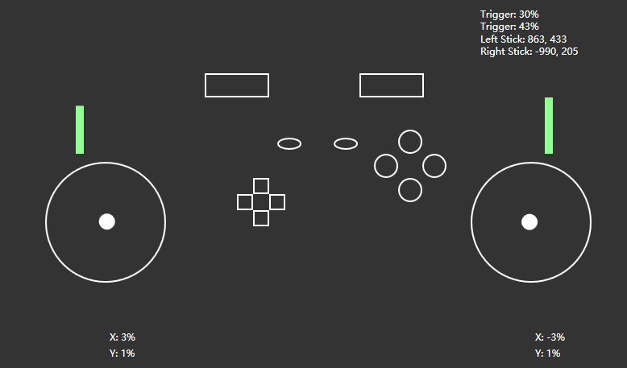

# JoystiX

## Description

This project is an Xbox controller tester application built using C#. It allows users to view the status of their Xbox controller in real-time, including the state of analog sticks, triggers, buttons, and motor vibrations.

<div style="display: flex; align-items: center; justify-content: center; height: 40vh;">
  
  
</div>


## Technologies Used

- **C#**: The programming language used for developing the application.
- **WPF (Windows Presentation Foundation)**: For building the graphical user interface.
- **SharpDX.XInput**: A library used to interact with the Xbox controller.

## Project Structure

The project consists of the following main components:

- `MainWindow.xaml`: The XAML file that defines the layout of the application's user interface.
- `MainWindow.xaml.cs`: The code-behind file that contains the logic for interacting with the Xbox controller and updating the UI.
- `app.config`: Configuration file for application settings (if needed).

## Features

### Real-Time Controller Status

- **Analog Sticks**: Displays the position of the left and right analog sticks.
- **Triggers**: Shows the pressure applied to the left and right triggers.
- **Buttons**: Indicates the pressed state of all buttons (A, B, X, Y, LB, RB, Start, Back, D-Pad).
- **Motor States**: Displays the state of the controller's vibration motors.

## How to Run the Project

1. **Clone the Repository**:
    ```sh
    git clone https://github.com/Kevoyuan/JoystiX
    cd JoystiX
     ```
2. **Open in Visual Studio**:
     Open the solution file JoystiX.sln in Visual Studio.

3. **Restore NuGet Packages**:
     Restore the required NuGet packages, especially SharpDX.XInput.

4. **Build and Run**:
     Build the project and run the application. Ensure your Xbox controller is connected.

### Premises Assumed
- The application is designed to run on a local development environment.
- The user interface should be intuitive and easy to use, with basic validations to ensure data integrity.

### Design Decisions
- ASP.NET Core API: Chosen for its efficiency in creating RESTful APIs, ease of integration, and support for essential middleware configurations.
- JavaScript: Used for dynamic manipulation of the interface, making the application more responsive and interactive.
- HTML/CSS: To ensure a semantic structure and good visual presentation of the application.

### Bonus Implementations
- Custom CSS styling for the interface.
- API following RESTful standards with good naming practices and proper use of HTTP methods.

### Conclusion
This project aims to demonstrate skills in web development using C# and ASP.NET Core, along with good coding practices and code organization. The reminder system provides a solid foundation for future expansions and improvements.